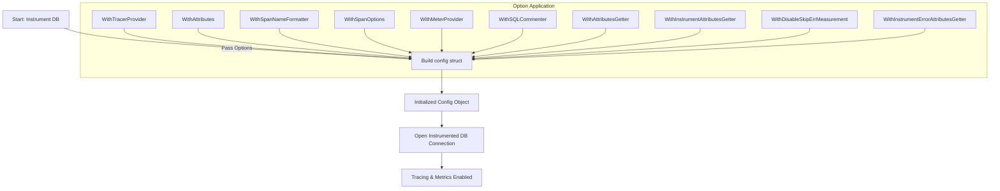

# Options and Configuration

The `otelsql` library provides a flexible and comprehensive set of configuration options to tailor telemetry instrumentation of your Go `database/sql` usage. This page dives into all available options you can apply to customize tracing spans, metrics, attribute enrichment, and context propagation — empowering you to realize insightful observability with your database interactions.

---

## Configuration Overview

When you instrument your database with `otelsql`, you configure the behavior primarily through the options pattern. These options adjust how spans are named, which attributes and metrics are attached, error handling behaviors, and whether extra context propagation features like SQLCommenter are enabled.

> These options empower you to align telemetry with your application’s objectives — whether that's maximizing trace detail, optimizing performance, or enhancing interoperability with distributed tracing systems.


## Working with Option Interface

All configurations in `otelsql` are applied through implementations of the `Option` interface. This design enables a clean, extensible setup where you pass a sequence of options to configure your instrumentation setup.

### Using Options: Key Functions

| Option Function                      | Purpose                                                     |
|------------------------------------|-------------------------------------------------------------|
| `WithTracerProvider`               | Specify a custom OpenTelemetry tracer provider             |
| `WithMeterProvider`                | Specify a custom provider for metrics measurement           |
| `WithAttributes`                  | Attach static attributes to every span and metric           |
| `WithSpanNameFormatter`            | Customize span names by processing method and query         |
| `WithSpanOptions`                  | Enable or disable detailed span features                    |
| `WithSQLCommenter`                 | Enable SQLCommenter context propagation via SQL comments    |
| `WithAttributesGetter`             | Provide dynamic attributes per span creation                |
| `WithInstrumentAttributesGetter`  | Provide dynamic attributes per metric recording             |
| `WithInstrumentErrorAttributesGetter` | Attach additional error attributes on metrics             |
| `WithDisableSkipErrMeasurement`   | Control how `driver.ErrSkip` is treated in error metrics    |

### Example: Setting Basic Options

```go
import (
	"go.opentelemetry.io/otel/attribute"
	"go.opentelemetry.io/otel/trace"
	"github.com/XSAM/otelsql"
)

// Create options for tracing, attributes, and SQLCommenter
options := []otelsql.Option{
	otelsql.WithTracerProvider(myTracerProvider),
	otelsql.WithAttributes(
		attribute.String("service.name", "order-service"),
		attribute.String("env", "production"),
	),
	otelsql.WithSQLCommenter(true),
}

// Use these options when opening your instrumented database
db, err := otelsql.Open("mysql", dsn, options...)
```

---

## Detailed Option Descriptions

### WithTracerProvider
- **Purpose:** Use a specific OpenTelemetry tracer provider rather than the global default.
- **Use Case:** When you want to control or customize tracing setup, for example to use a tracer with custom exporters or sampling.

### WithMeterProvider
- **Purpose:** Set a custom metrics provider to enable flexible metrics export.
- **Use Case:** Use alongside OpenTelemetry metrics SDK for Prometheus or other exporters.

### WithAttributes
- **Purpose:** Define static key-value pairs included on every span and metric from otelsql.
- **Example:** Service name, environment, or application version.

### WithSpanNameFormatter
- **Purpose:** Customize how span names are generated based on SQL method and query.
- **Details:** You provide a function:

```go
func(ctx context.Context, method otelsql.Method, query string) string
```

that returns a string for the span name.


### WithSpanOptions
- **Purpose:** Fine-tune which span features are enabled (e.g., Ping spans, error recording, query suppression).
- **Usage Consideration:** Adjusting these controls performance and detail trade-offs.

#### SpanOptions Fields

| Field               | Description                                          | Default |
|---------------------|------------------------------------------------------|---------|
| Ping                | Instrument `Ping` calls with spans                   | false   |
| RowsNext            | Record events inside span for RowNext calls          | false   |
| DisableErrSkip      | Suppress spans for `driver.ErrSkip`                  | false   |
| DisableQuery        | Suppress `db.statement` attribute in spans          | false   |
| RecordError         | Custom function to decide whether to record errors  | nil     |
| OmitConnResetSession| Suppress `reset_session` spans                        | false   |
| OmitConnPrepare     | Suppress `prepare` spans                              | false   |
| OmitConnQuery       | Suppress `query` spans                                | false   |
| OmitRows            | Suppress `rows` spans                                 | false   |
| OmitConnectorConnect| Suppress connector connect spans                     | false   |
| SpanFilter          | Filter function to conditionally create spans       | nil     |

---

### WithSQLCommenter
- **Purpose:** Enable automatic context propagation by injecting W3C trace context and state into SQL via comments.
- **Example:**

```sql
SELECT * FROM users /*traceparent='00-4bf92f3577b34da6a3ce929d0e0e4736-00f...-01',tracestate='congo%3Dt61rcWkgMzE%2Crojo%3D...*/
```

- **Note:** This is an experimental feature that aids distributed tracing propagation through databases.

---

### AttributesGetter
- **Purpose:** Dynamically attach attributes on span creation.
- **Function signature:**

```go
func(ctx context.Context, method otelsql.Method, query string, args []driver.NamedValue) []attribute.KeyValue
```

- **Use Case:** Context-aware attributes derived from the current operation or arguments.

### InstrumentAttributesGetter and InstrumentErrorAttributesGetter
- **Purpose:** Attach attributes dynamically every time a metric is recorded, or every time an error metric is recorded.
- **Benefit:** Adding richer context to metrics in real-time.

---

### WithDisableSkipErrMeasurement
- **Purpose:** Determines whether errors of type `driver.ErrSkip` should be recorded as errors or as successful measurements.
- **Default:** false (treated as errors)
- **Disable (`true`):** Measurements with `ErrSkip` treated as success (`status=ok`).

---

## Typical User Workflow

<Steps>
<Step title="Step 1: Choose and configure your Tracer and Meter">
Select or create providers for tracing and metrics aligned with your observability backend.
</Step>
<Step title="Step 2: Define attributes and span naming">
Set static attributes with `WithAttributes` and implement custom naming with `WithSpanNameFormatter` if needed.
</Step>
<Step title="Step 3: Customize span details and error handling">
Tune which spans and events to include or suppress with `WithSpanOptions`.
</Step>
<Step title="Step 4: Enable SQLCommenter for context propagation (optional)">
Use `WithSQLCommenter(true)` to enhance distributed traces.
</Step>
<Step title="Step 5: Open instrumented DB connection">
Pass all options when opening your database with `otelsql.Open` to initiate tracing and metrics.
</Step>
</Steps>

## Practical Example: Customizing Span Names and Attributes

```go
opts := []otelsql.Option{
	otelsql.WithAttributes(
		attribute.String("service.name", "inventory"),
	),
	otelsql.WithSpanNameFormatter(func(ctx context.Context, method otelsql.Method, query string) string {
		// Use first word of SQL query as span name for clarity
		if len(query) > 0 {
			return method.String() + " - " + strings.ToUpper(strings.Split(query, " ")[0])
		}
		return method.String()
	}),
}

db, err := otelsql.Open("postgres", dsn, opts...)
if err != nil {
	log.Fatal(err)
}
```

---

## Tips and Best Practices

- Use `WithSpanNameFormatter` to create meaningful and context-rich span names that aid trace readability.
- Static attributes set through `WithAttributes` establish baseline identifiers for all spans.
- Use `WithAttributesGetter` to enrich spans dynamically based on query parameters or execution context.
- Enable `WithSQLCommenter` to improve distributed trace correlation across service boundaries involving databases.
- Adjust `SpanOptions` conservatively to avoid high overhead with many events, especially on high-volume queries.
- Handle `driver.ErrSkip` deliberately by configuring `WithDisableSkipErrMeasurement` to align metrics with your error policies.

---

## Troubleshooting Common Issues

### Spans Missing Expected Attributes
- Ensure you set attributes using the correct options and they are applied when opening the DB.
- When using dynamic attribute functions, confirm they return expected values for your context.

### Too Many Span Events Causing Performance Impact
- Disable features in `SpanOptions` such as `RowsNext` or omit spans like `sql.rows` if detailed events are not necessary.

### SQLCommenter Not Injecting Comments
- Verify `WithSQLCommenter(true)` is explicitly enabled.
- Confirm your database driver does not strip comments.
- Remember this is experimental and may behave differently in some environments.

---

## Related Documentation

- [Instrumenting database/sql](../core-api/instrumenting-database) — Learn how to use core Open, Register, and WrapDriver APIs with options.
- [RegisterDBStatsMetrics](../core-api/metrics-instrumentation) — Collect detailed connection pool metrics using options.
- [Semantic Conventions and Stability Levels](../advanced-reference/semantic-conventions) — Understand semantic conventions affecting attributes.
- [SQLCommenter Guide](../../guides/advanced-scenarios/sqlcommenter-context-propagation) — Deep dive into context propagation via SQL comments.

---

## Source Code Reference

Explore the implementation of these options in the source files on GitHub:

- [`option.go`](https://github.com/XSAM/otelsql/blob/main/option.go)
- [`config.go`](https://github.com/XSAM/otelsql/blob/main/config.go)

These files define the option interface and default configuration behaviors.


---

## Diagram: Configuration Flow

