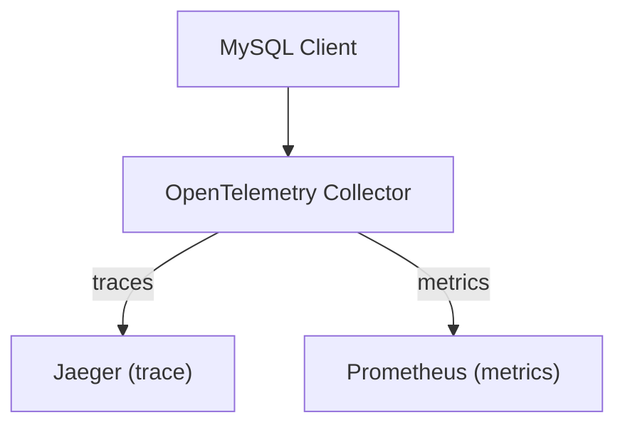
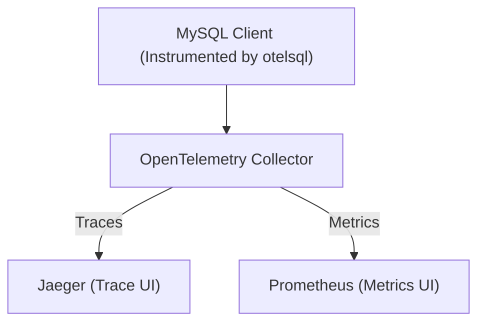

# Run Local Examples (Docker & Compose)

This guide helps you run the provided example environments using Docker Compose to see otelsql instrumentation in action. You will launch a fully integrated setup that generates database traces and exposes metrics, viewable via popular observability tools like Jaeger and Prometheus.

---

## 1. Prerequisites & Requirements

- **Docker & Docker Compose**: Ensure Docker is installed and Docker Compose V2 is available. See the [Docker Compose installation guide](https://docs.docker.com/compose/install/) if needed.
- **Port Availability**: Confirm that the following ports are free on your local machine:
  - 16686 (Jaeger UI)
  - 9090 (Prometheus UI)
- **Basic Docker Knowledge**: Familiarity with running and managing containers will help during troubleshooting.

<Tip>
Running these examples locally simulates real-world telemetry pipelines, enabling you to quickly validate otelsql's end-to-end tracing and metrics integration without extra setup.
</Tip>

## 2. Starting the Example Environment

The example uses Docker Compose to orchestrate several services:

- A MySQL database
- OpenTelemetry Collector
- Jaeger (for trace visualization)
- Prometheus (for metrics)
- The instrumented Go client

<Steps>
<Step title="Navigate to the Example Directory">
Open your terminal and change directory to the `example/otel-collector` folder inside the project root:

```bash
cd example/otel-collector
```
</Step>
<Step title="Launch All Services with Docker Compose">
Run the following command to bring up all services in the background:

```bash
docker compose up -d
```

Docker will download required images and start containers for MySQL, OpenTelemetry Collector, Jaeger, Prometheus, and the Go client.
</Step>
<Step title="Verify Client Completion">
Check the logs of the `client` service to ensure it ran successfully:

```bash
docker compose logs client
```

Look for output indicating the database operations and telemetry data were sent without errors.
</Step>
</Steps>

<Tip>
If you're running into permission or network issues, ensure Docker daemon is running and you have rights to run containers.
</Tip>

## 3. Accessing Observability UIs

Once the services are running and the client has completed:

- **Jaeger UI (Tracing)**
  - Visit: [http://localhost:16686](http://localhost:16686)
  - Use this UI to explore the spans generated by the instrumented MySQL client connected via otelsql.

- **Prometheus UI (Metrics)**
  - Visit: [http://localhost:9090](http://localhost:9090)
  - View real-time metrics scraped from the OpenTelemetry Collector.

<Note>
If you don't see data immediately, refresh the UIs or check container logs for errors.
</Note>

## 4. Stopping the Example Environment

To cleanly shut down all the services and free system resources:

```bash
docker compose down
```

This stops and removes the containers without deleting any local data volumes.

## 5. Understanding the Example Setup

The data flow through the example environment is:



- The instrumented Go client performs SQL operations on MySQL.
- Telemetry data (traces and metrics) is sent via OTLP protocol to the OpenTelemetry Collector.
- The Collector exports traces to Jaeger and metrics to Prometheus.

## 6. Troubleshooting Common Issues

<AccordionGroup title="Common Problems and Solutions">
<Accordion title="Docker Compose Fails to Start Services">
- Ensure Docker daemon is running.
- Verify you have Docker Compose v2 installed (`docker compose version`).
- Check for port conflicts.
- Look at logs with `docker compose logs` for errors.
</Accordion>
<Accordion title="Client Logs Show Errors Connecting to MySQL">
- Confirm the `mysql` container is healthy by running `docker compose ps`.
- Check environment variables for the correct root password.
- Allow a few seconds after startup for MySQL to become ready.
</Accordion>
<Accordion title="No Traces or Metrics Show Up in UI">
- Verify services are running (`docker compose ps`).
- Make sure the client log indicates telemetry was sent.
- Restart with `docker compose down && docker compose up -d`.
- Check network access between containers.
</Accordion>
</AccordionGroup>

## 7. Next Steps

- Explore the [example/otel-collector/README.md](https://github.com/XSAM/otelsql/blob/main/example/otel-collector/README.md) for more context on this specific example.
- Try modifying the Go client or OpenTelemetry Collector configuration to deepen your understanding.
- Continue to [First otelsql Integration](../configuration-usage/first-otel-instrumentation) to instrument your own applications.
- Visit the [Next Steps: Explore Metrics & Traces](../next-steps-explore-metrics) page to learn how to analyze and use telemetry data.

---

## References

- [Docker Compose documentation](https://docs.docker.com/compose/)
- [OpenTelemetry Collector configuration](./otel-collector.yaml)
- [Prometheus scrape configuration](./prometheus.yaml)
- [Jaeger UI](http://localhost:16686)
- [Prometheus UI](http://localhost:9090)


---

Thank you for trying the otelsql local examples! This hands-on environment gives a direct view into how database instrumentation produces observability data.


---

# Additional Information

### File locations
- `example/otel-collector/Dockerfile` - Container build for the instrumented Go SQL client
- `example/otel-collector/docker-compose.yaml` - Orchestrates all example services
- `example/otel-collector/otel-collector.yaml` - Collector config to route telemetry data
- `example/otel-collector/prometheus.yaml` - Prometheus scrape settings


<Tip>
Starting with this example is the fastest way to validate and experience otelsql's core observability features live.
</Tip>


---

## Summary Diagram




---

Ready to see otelsql observability in action? Follow these steps, explore the dashboards, and unlock visibility into your database operations.

