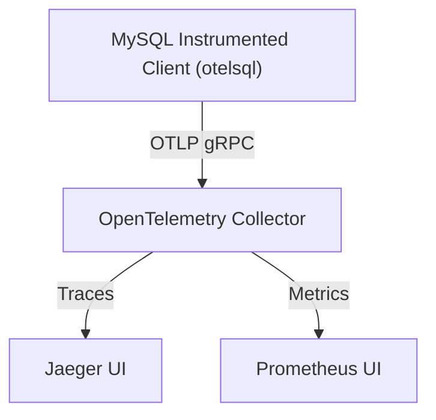

# Sending Telemetry to the OpenTelemetry Collector

This guide provides a detailed walkthrough for configuring otelsql to export tracing and metrics telemetry to the OpenTelemetry Collector. You will learn how to set up a Docker Compose environment with MySQL, OpenTelemetry Collector, Jaeger, and Prometheus, configure the collector to receive and forward data, and visualize telemetry results.

---

## Workflow Overview

- **Task Description**: Enable otelsql instrumentation to send trace spans and metrics from Go's database/sql interactions through an OpenTelemetry Collector, then visualize these data in Jaeger (traces) and Prometheus (metrics).
- **Prerequisites**:
  - Basic Go development knowledge
  - otelsql instrumented database/sql application
  - Docker Compose V2 installed locally
- **Expected Outcome**: A fully operational telemetry pipeline where Go SQL operations produce trace and metric data visible in Jaeger and Prometheus UI.
- **Time Estimate**: 20-30 minutes
- **Difficulty Level**: Intermediate

---

## Step-by-Step Instructions

### 1. Prepare the Docker Compose Environment

This setup uses a multi-service Docker Compose file that orchestrates a MySQL database, OpenTelemetry Collector, Prometheus, Jaeger, and a client application with instrumented Go SQL.

#### Actions:

- Place the provided `docker-compose.yaml` file in your working directory.
- This file declares:
  - **mysql**: MySQL 8.4 instance with root password and sample DB.
  - **otel-collector**: OpenTelemetry Collector handling OTLP data, forwarding traces to Jaeger and metrics to Prometheus.
  - **prometheus**: Scrapes metrics exposed by the collector.
  - **jaeger**: Visualizes distributed traces.
  - **client**: A sample Go app instrumented with otelsql.

#### Verify:

- `docker-compose.yaml` includes correct service dependencies ensuring order and health check for MySQL.
- Ensure the required config files `otel-collector.yaml` and `prometheus.yaml` are in the same directory.

### 2. Configure OpenTelemetry Collector

The collector configuration defines receivers, processors, exporters, and pipeline setups.

#### Actions:

- Create or verify `otel-collector.yaml` with these components:
  - **Receiver**: `otlp` configured with gRPC to receive telemetry on `0.0.0.0:4317`.
  - **Processor**: `batch` and `memory_limiter` for efficient data processing.
  - **Exporters**:
    - `otlp` exporter sending traces to Jaeger on `jaeger:4317`.
    - `prometheus` exporter exposing metrics on port `9090`.
  - **Service Pipelines**:
    - `traces`: Receives OTLP traces, processes, exports to Jaeger.
    - `metrics`: Receives OTLP metrics, processes, exports to Prometheus.
  - Ensure `health_check` extension is enabled.

#### Verify:

- The correct ports are exposed and linked.
- TLS is disabled for the example collector-to-Jaeger connection (useful for local setups).

### 3. Configure Prometheus

Setup Prometheus to scrape metrics exposed by the OpenTelemetry Collector.

#### Actions:

- Create or confirm `prometheus.yaml` has a scrape job targeting `otel-collector:9090` every 5 seconds.

### 4. Build and Run the Example Client

The client is a Go application instrumented with otelsql that performs a SQL query, generating trace and metric data.

#### Actions:

- Navigate to the example directory with the `Dockerfile` and Go code (`example/otel-collector`).
- Build Docker images and bring up services:
  ```bash
  docker compose up -d
  ```
- Monitor client logs to ensure queries run successfully:
  ```bash
  docker compose logs client
  ```

- The client application:
  - Uses `otelsql.Open` to connect with attributes including MySQL system info.
  - Registers DB stats metrics using `otelsql.RegisterDBStatsMetrics`.
  - Runs a sample query within a traced context.

#### Verify:

- No errors in client logs.

### 5. Access and Visualize Telemetry

#### Actions:

- Open the Jaeger UI at [http://localhost:16686](http://localhost:16686) to view distributed traces.
- Open the Prometheus UI at [http://localhost:9090](http://localhost:9090) to explore metrics.

#### Expected Results:

- Jaeger shows traced spans for SQL queries, with operation names and attributes reflecting database calls.
- Prometheus shows metrics such as:
  - `db_client_operation_duration_seconds`
  - `db_sql_connection_open`
  - `db_sql_latency` (legacy metric)

---

## Practical Tips & Best Practices

- **Use Consistent Resource Attributes**: The example uses service name `otesql-example`, which should be consistent across your telemetry sources.
- **Secure Transport**: The example disables TLS (`insecure: true`) for OTLP between collector and Jaeger. Always enable TLS for production.
- **Adjust Sampling**: The example uses `AlwaysSample` for tracing, which is suitable for testing but should be sampled appropriately in production.
- **Metric Scraping Frequency**: Fine-tune Prometheus scrape intervals as needed.
- **Error Handling**: The example client records errors in spans if queries fail.

---

## Troubleshooting

<AccordionGroup title="Troubleshooting Common Issues">
<Accordion title="Collector Fails to Start or Bind Ports">
- Check for port conflicts on 4317 (collector OTLP gRPC), 9090 (Prometheus), and 16686 (Jaeger).
- Confirm Docker Compose logs for the collector:
  ```bash
  docker compose logs otel-collector
  ```
</Accordion>
<Accordion title="Client Does Not Produce Telemetry">
- Verify client is connecting to collector URL `otel-collector:4317`.
- Ensure correct Go dependencies and versions for otelsql and OpenTelemetry SDK.
- Confirm that `otelsql.Open` is called with correct attributes.
- Check client logs for errors.
</Accordion>
<Accordion title="Metrics Not Visible in Prometheus">
- Ensure Prometheus is scraping the collector endpoint.
- Verify `prometheus.yaml` targets `otel-collector:9090`.
- Check Prometheus logs and targets status at Prometheus UI.
</Accordion>
<Accordion title="Traces Not Visible in Jaeger">
- Confirm collector forwards traces to Jaeger at `jaeger:4317`.
- Check Jaeger UI and logs.
- Verify OTLP receiver is correctly configured.
</Accordion>
</AccordionGroup>

---

## Diagram of Telemetry Flow



---

## Next Steps & Related Content

- Explore advanced instrumentation configuration in [First otelsql Integration](/getting-started/configuration-usage/first-otel-instrumentation).
- Learn how to verify basic tracing and metrics in [Viewing Traces and Metrics: Quick Verification](/guides/getting-started/basic-tracing-metrics).
- Dive deeper into metrics exploration via [Next Steps: Explore Metrics & Traces](/getting-started/examples-integration/next-steps-explore-metrics).
- Review troubleshooting for common issues in [Troubleshooting: Missing Spans or Metrics](/guides/advanced-scenarios/troubleshooting-signals).

---

## Reference Code Snippet: Connecting with otelsql

```go
attrs := append(otelsql.AttributesFromDSN(mysqlDSN), semconv.DBSystemNameMySQL)
db, err := otelsql.Open("mysql", mysqlDSN, otelsql.WithAttributes(attrs...))
if err != nil {
  log.Fatal(err)
}

err = otelsql.RegisterDBStatsMetrics(db, otelsql.WithAttributes(attrs...))
if err != nil {
  log.Fatal(err)
}
```

This snippet establishes an instrumented `sql.DB` connection and registers metrics collection.

---

## Summary
This guide showed how to set up otelsql telemetry export to an OpenTelemetry Collector, which aggregates and routes traces to Jaeger and metrics to Prometheus. By following the stepwise approach, you gain end-to-end visibility into your Go SQL client instrumentation.

---