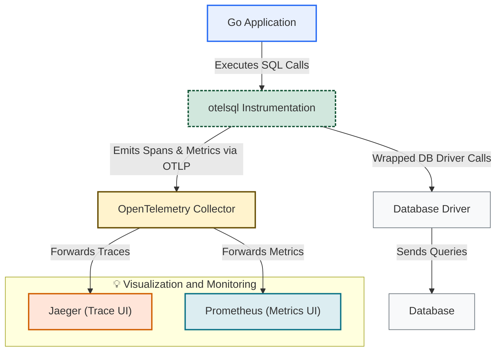

# Architecture & Data Flow

## Understanding How otelsql Integrates within Your Application Ecosystem

Instrumenting your application's database interactions with otelsql means more than just adding observability—it means seamlessly embedding tracing and metrics collection into your existing Go application stack. This page walks you through the flow of telemetry data from your application, through otelsql instrumentation, into telemetry backends such as Jaeger for tracing and Prometheus for metrics.

---

### How otelsql Fits Into Your Application Architecture

At its core, otelsql wraps the standard `database/sql` package in Go, providing transparent telemetry instrumentation without changing your existing database access code. Its design enables you to register instrumented database connections that automatically emit OpenTelemetry spans and metrics.

This instrumentation feeds into your choice of OpenTelemetry-compatible observability tools, typically an OpenTelemetry Collector, which processes, enriches, and forwards trace and metrics data to backend systems.

---

### The Data Flow Workflow

Visualize the trace and metrics journey:

1. **Application Code:** Your Go services use `database/sql` to interact with databases as usual.
2. **otelsql Instrumentation:** Instead of a raw database connection, your app uses otelsql’s driver wrapper—this captures span creation and metrics emission for every SQL operation.
3. **OpenTelemetry Collector:** The emitted telemetry data is sent via OTLP (OpenTelemetry Protocol) to a collector running as a service.
4. **Exposure to Backends:** The collector routes traces to Jaeger and metrics to Prometheus, enabling you to visualize and analyze performance and behavior.

---

### Key Components in the Architecture

- **Go Application:** Initiates DB requests with instrumented otelsql driver.
- **Database Driver:** Wrapped by otelsql to interpose telemetry collection.
- **OpenTelemetry Collector:** Central gateway handling telemetry data forwarding.
- **Tracing Backend (Jaeger):** Visualizes distributed trace data.
- **Metrics Backend (Prometheus):** Captures and displays database traffic metrics.

---

### Mermaid Diagram: Telemetry Data Flow with otelsql



This diagram clearly maps out how otelsql acts as the crucial bridge intercepting database calls to enrich them with tracing and metrics information before transmitting the telemetry data to your observability infrastructure.

---

### Real-World Context: From Code to Insights

Imagine you have a Go service querying a MySQL database. With otelsql:

- Every query, prepare, and transaction call gets wrapped automatically.
- You immediately have visibility into query performance, error rates, and latency.
- Combined with your existing OpenTelemetry setup, these data points become part of overall service performance monitoring.

This means faster debugging, optimized queries, and informed capacity planning—all without writing extra telemetry code.

---

### Best Practices for Instrumentation Integration

- **Register Your Database Once:** Use `otelsql.Register` at application startup to create instrumented drivers.
- **Configure OpenTelemetry Collector Properly:** Ensure the OTLP endpoint is accessible and correctly configured to forward traces and metrics.
- **Use Context Propagation:** Propagate context through your app to capture end-to-end distributed traces.
- **Monitor Collector Health:** Use health endpoints and logging to confirm your open telemetry data pipeline is live.

---

### Common Pitfalls and Troubleshooting

<AccordionGroup title="Troubleshooting Telemetry Data Flow">
<Accordion title="Spans or Metrics Not Appearing in Jaeger or Prometheus">
Check that your instrumented database connection is used instead of uninstrumented one. Confirm OTLP export configuration and network connectivity between your application and the OpenTelemetry Collector.
</Accordion>
<Accordion title="Collector Configuration Issues">
Validate your collector config YAML for syntax and endpoint correctness. Confirm the collector is running and listening on the expected OTLP ports.
</Accordion>
<Accordion title="Database Driver Compatibility Problems">
Ensure your database driver version and otelsql wrapper support each other. Unsupported drivers might silently lose telemetry data.
</Accordion>
</AccordionGroup>

---

### Getting Started Preview

To quickly see otelsql architecture in action, set up the example environment with Docker Compose to run a sample MySQL client, OpenTelemetry Collector, Jaeger, and Prometheus:

```bash
docker compose up -d
```

Access the Jaeger UI at http://localhost:16686 and Prometheus UI at http://localhost:9090 to explore traces and metrics. This hands-on experience will deepen your understanding of the data flows detailed here.

For detailed setup and configuration, refer to the Getting Started and Integration documentation sections.

---

## Additional Resources

- [What is otelsql?](https://github.com/XSAM/otelsql/blob/main/overview/product-intro-core-value/what-is-otelsql.mdx) – Core product introduction.
- [Value Proposition & Primary Use Cases](https://github.com/XSAM/otelsql/blob/main/overview/product-intro-core-value/value-proposition-use-cases.mdx) – Why otelsql matters.
- [Integration Example: OTEL Collector](https://github.com/XSAM/otelsql/blob/main/guides/advanced-scenarios/otel-collector-integration.mdx) – How to forward telemetry data.

Use the navigation sidebar to explore architecture concepts and the rich API documentation to dive deeper into how to customize otelsql for your environment.
