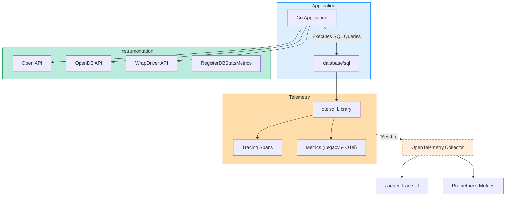

# Feature Overview

Discover the full spectrum of features that make **otelsql** a powerful and flexible solution for instrumenting Go's `database/sql` package with OpenTelemetry. This page provides a practical summary of the key APIs, tracing capabilities, semantic conventions, metrics support, error handling, and compatibility details. Understanding these features will prepare you for the detailed implementation guides and best practices found elsewhere in the documentation.

---

## Why This Matters: Enhancing Visibility Into Your Database Interactions

Imagine gaining immediate, rich insights into every SQL query your application runs — with minimal code changes, in multiple adaptable ways. The features summarized here empower you to do just that, enabling detailed tracing and metrics collection that illuminate performance bottlenecks, error sources, and usage patterns.

Whether your application uses direct SQL drivers, OpenDB connections, or legacy instrumentation methods, otelsql provides the flexibility and consistency needed to embed OpenTelemetry seamlessly.

---

## Multiple Ways to Instrument Your Database Calls

otelsql offers several APIs to fit a variety of user scenarios and coding styles:

- **Open**: The simplest way to instrument by opening a database connection directly with tracing wrapped inside.
  ```go
  db, err := otelsql.Open("mysql", dsn)
  ```
- **OpenDB**: Use this to wrap an existing `*sql.DB` instance, perfect when you already have a connection pool but want to add telemetry.
  ```go
  otelDB := otelsql.OpenDB(driverConnector)
  ```
- **RegisterDBStatsMetrics**: Allows you to collect legacy-style metrics reflecting database connection pool stats, such as open connections and wait times.
- **WrapDriver**: For advanced users who want to wrap a SQL driver to embed tracing without changing their connection code.

This variety ensures compatibility with different application architectures and enables incremental adoption.

---

## Tracing Support with Flexible Semantic Conventions

Traces are critical to understanding the flow of requests through your system, and otelsql offers robust support for tracing your SQL queries:

- **Automatic Span Creation**: Each SQL operation (query, exec, prepare, etc.) generates spans with detailed attributes.
- **Semantic Conventions**: otelsql supports both legacy and the latest stable OpenTelemetry semantic conventions, giving you flexibility to evolve your telemetry without breaking changes.
- **Flexible Attributes**: Users can customize which semantic conventions to adopt, ensuring telemetry aligns with your observability standards.

This flexibility lets you maintain rich, meaningful traces that conform to evolving OpenTelemetry specifications.

---

## Distinguishing Legacy vs. OpenTelemetry Metrics

Metrics tooling in observability is rapidly evolving. otelsql recognizes this by:

- Offering **legacy metrics** that capture `database/sql` pool states such as idle and open connections, waits, and max open.
- Supporting **OTel-compliant metrics** for newer implementations, promoting parity with OpenTelemetry ecosystem standards.

Users can choose the approach that best fits their current stack and future planning. This dual support eases migration paths and enables more nuanced telemetry capture.

---

## Precise Error Attribution and Handling

Understanding failures and their impact is crucial. otelsql enhances error visibility by:

- Capturing and associating errors at the span level, ensuring traces reflect failures accurately.
- Differentiating between transient and persistent errors where possible, providing richer context in telemetry.
- Enabling users to better analyze root causes from distributed trace data without manual correlation.

This targeted error handling accelerates troubleshooting and increases confidence in your observability data.

---

## Compatibility Across Drivers and OpenTelemetry Ecosystem

otelsql is designed to work smoothly across Go SQL drivers, leveraging OpenTelemetry's wide ecosystem:

- Compatible with major SQL drivers (MySQL, Postgres, SQLite, and more).
- Integrates with OpenTelemetry Collector setups for export to tracing and metric backends like Jaeger, Prometheus.
- Supports multiple OpenTelemetry API versions and instrumentation patterns, ensuring long-term maintainability.

This means you can adopt otelsql in your environment without disrupting existing infrastructure or tooling.

---

## Visualizing Instrumentation Options and Data Flow



This flow highlights how application code integrates with otelsql’s multiple instrumentation APIs, which generate traces and metrics sent via the OpenTelemetry Collector to backends.

---

## Practical Tips and Best Practices

- **Choose the right instrumentation API** based on your application's existing architecture: use `Open` for new connections, `OpenDB` for wrapping existing pools.
- **Adopt semantic conventions strategically** — start with legacy conventions if already in place, and migrate gradually to stable OpenTelemetry conventions.
- **Use RegisterDBStatsMetrics judiciously** to capture pool metrics without adding tracing overhead.
- **Ensure your OpenTelemetry Collector configuration matches your backends** to receive and export the telemetry properly (see example configurations).
- **Pay attention to error attribution in your traces** to identify problematic queries faster.

---

## Summary

This page outlines otelsql's core feature set, emphasizing the diverse instrumentation APIs, powerful tracing and metrics support, semantic flexibility, and seamless compatibility. These features combine to give you actionable observability and empower fast, accurate diagnostics for your applications’ database interactions.

For step-by-step implementation, explore the [Quickstart Instrumentation](../guides/getting-started/quickstart-instrumentation), or see the [Integration with OpenTelemetry Collector](../guides/advanced-scenarios/otel-collector-integration) for deployment examples.

---

## Next Steps

- Visit the [Quickstart Instrumentation Guide](/guides/getting-started/quickstart-instrumentation) to see how to begin capturing telemetry with otelsql.
- Explore [Semantic Convention Migration](/guides/advanced-scenarios/semantic-convention-migration) to understand how to smoothly update your tracing attributes.
- Review [Error Handling and Attribution](/api-reference/advanced-reference/error-handling) for deeper insight into troubleshooting.


<br/>
---

<Info>
This overview sets the foundation for mastering otelsql’s instrumentation. Dive into detailed guides and examples to see these powerful features in action and tailor your observability strategy.
</Info>
