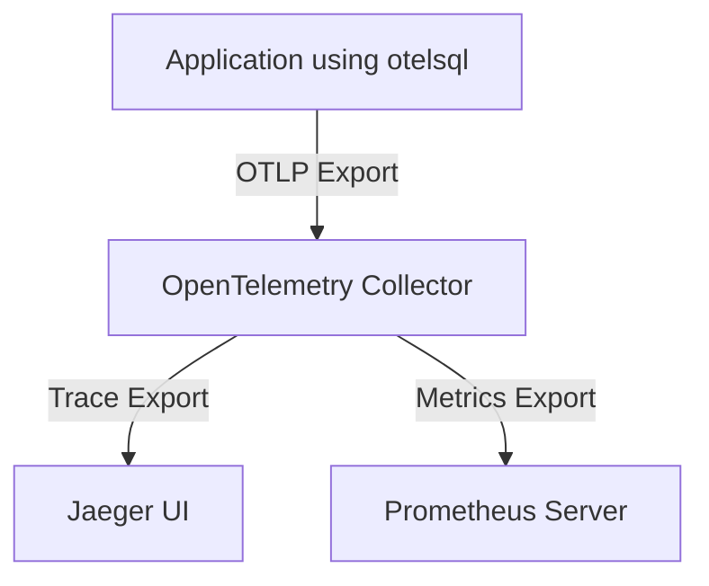

# Integration with Observability Systems

Experience how otelsql seamlessly integrates with common observability backends like stdout logging, Prometheus, and the OpenTelemetry Collector to deliver rich insights through tracing and metrics. This page walks you through concrete examples and practical configuration patterns to start sending telemetry data confidently and view it using familiar tools.

---

## Why Integration Matters

When instrumenting your Go applications using database/sql, telemetry data becomes most valuable when it reaches the right backend systems — ones where developers, SREs, and analysts can efficiently monitor and investigate database interactions. Otelsql enables that connectivity out of the box, making it easy to route your traces and metrics into your existing observability ecosystem.

Choosing the right integration depends on your environment:

- **Stdout**: Quick, local debugging and verification.
- **Prometheus**: Metrics-focused monitoring with alerting capabilities.
- **OpenTelemetry Collector**: A flexible pipeline that forwards data to Jaeger, Prometheus, and other exporters.

---

## Sending Telemetry to Stdout

For rapid local development or troubleshooting, otelsql supports sending telemetry data directly to your application's standard output.

```go
import (
    "database/sql"
    "log"

    _ "github.com/go-sql-driver/mysql"
    "go.opentelemetry.io/otel"
    "go.opentelemetry.io/otel/exporters/stdout/stdouttrace"
    "go.opentelemetry.io/otel/sdk/trace"
    "github.com/XSAM/otelsql"
)

func setupDB() (*sql.DB, error) {
    // Initialize stdout exporter
    exporter, err := stdouttrace.New(stdouttrace.WithPrettyPrint())
    if err != nil {
        return nil, err
    }
    tp := trace.NewTracerProvider(trace.WithBatcher(exporter))
    otel.SetTracerProvider(tp)

    // Wrap your database driver with otelsql
    otelDriverName, err := otelsql.Register("mysql", otelsql.WithTracerProvider(tp))
    if err != nil {
        return nil, err
    }

    // Open instrumented DB
    db, err := sql.Open(otelDriverName, "user:pass@tcp(localhost:3306)/db")
    if err != nil {
        return nil, err
    }
    return db, nil
}
```

This outputs human-readable tracing spans to your console, helping you quickly verify instrumentation and understand individual SQL query execution.

---

## Integrating with Prometheus Metrics

Otelsql can expose rich metrics conforming to Prometheus standards, enabling in-depth monitoring of database call performance and error rates.

1. Configure metrics registration:

```go
import (
    "github.com/XSAM/otelsql"
    "github.com/prometheus/client_golang/prometheus/promhttp"
    "net/http"
)

func setupMetrics() {
    // Register database/sql stats metrics for Prometheus
    otelsql.RegisterDBStatsMetrics()

    // Serve metrics endpoint
    http.Handle("/metrics", promhttp.Handler())
    go http.ListenAndServe(":2112", nil)
}
```

2. Scrape metrics using Prometheus by adding a scrape config to pull from your app's `/metrics` endpoint.

You’ll receive metrics such as:

- SQL call latency distributions
- Number of open connections
- In-flight query counts

This setup allows operational teams to create dashboards and alerts that monitor database interaction health in real-time.

---

## Routing Data Through the OpenTelemetry Collector

For an enterprise-grade, flexible observability pipeline, otelsql supports exporting telemetry to an OpenTelemetry Collector, which can forward data to multiple backends like Jaeger or Prometheus.

### How It Works



The Collector handles batching, retries, and transformation, ensuring your telemetry data flow scales gracefully.

### Sample Collector Configuration

Here’s a basic `otel-collector.yaml` configuration showing how traces and metrics are processed and exported:

```yaml
receivers:
  otlp:
    protocols:
      grpc:
        endpoint: "0.0.0.0:4317"

processors:
  batch:
  memory_limiter:
    limit_percentage: 75
    check_interval: 1s

exporters:
  otlp:
    endpoint: "jaeger:4317"
    tls:
      insecure: true
  prometheus:
    endpoint: 0.0.0.0:9090
  debug:
    verbosity: detailed

service:
  extensions: [health_check]
  pipelines:
    traces:
      receivers: [otlp]
      processors: [memory_limiter, batch]
      exporters: [otlp]

    metrics:
      receivers: [otlp]
      processors: [memory_limiter, batch]
      exporters: [prometheus]
```

### Running the Full Example

Otelsql’s example repository includes a Docker Compose setup that launches:

- A MySQL database
- OpenTelemetry Collector
- Prometheus server
- Jaeger UI
- Instrumented example client app

```sh
docker compose up -d
```

Access [Jaeger UI](http://localhost:16686) and [Prometheus UI](http://localhost:9090) in your browser to visualize traces and metrics.

> Logs of the client service verify that telemetry is emitted correctly.

```sh
docker compose logs client
```

---

## Configuration Best Practices

- **Choose exporters based on your use case:** Stdout for debugging, Prometheus for metrics-centric monitoring, OpenTelemetry Collector for scalable, flexible pipelines.
- **Keep your OTEL Collector config minimal but robust:** Include batching and memory limiting processors to handle load smoothly.
- **Use the example Docker Compose setup** to validate your observability infrastructure in a sandbox before production.
- **Register DB stats metrics explicitly** if you want Prometheus visibility.

---

## Troubleshooting Common Issues

<AccordionGroup title="Troubleshooting Common Integration Scenarios">
<Accordion title="No telemetry appearing in Prometheus">
Verify your metrics endpoint is exposed and that Prometheus scrape config targets it. Check network connectivity and logs for errors in both your app and Prometheus server.
</Accordion>
<Accordion title="Traces not showing in Jaeger">
Check that otelsql is configured to export via OTLP and that the Collector is running and reachable at the specified endpoint. Inspect Collector logs for spool or endpoint failures.
</Accordion>
<Accordion title="High memory usage in Collector">
Ensure the `memory_limiter` processor is configured appropriately. Consider tuning batch sizes and exporter endpoints to avoid backpressure.
</Accordion>
</AccordionGroup>

---

## Summary

Integrating otelsql with your observability systems empowers you to monitor and troubleshoot database interactions with ease. Whether you’re iterating locally with stdout traces, building Prometheus dashboards, or deploying full OTEL Collector pipelines feeding Jaeger and Prometheus, otelsql adapts to your environment.

Start with simple configurations to validate your instrumentation, then scale up to robust, production observability pipelines.

---

## Next Steps

- Visit the [Getting Started Examples](../../getting-started/examples-integration/local-quickstart-examples) page to run local integration demos.
- Explore the [OpenTelemetry Collector Integration Guide](../../guides/advanced-scenarios/otel-collector-integration) for deeper customization.
- Review [Value Proposition & Primary Use Cases](../../overview/product-intro-core-value/value-proposition-use-cases) for how otelsql fits your organization.

---

<Check>
Integrate otelsql with your telemetry backend to unlock actionable insights from your database operations and accelerate incident detection and resolution.
</Check>

---

## Source Code and Examples

- [Example OpenTelemetry Collector Docker Compose and Config](https://github.com/XSAM/otelsql/blob/main/example/otel-collector/docker-compose.yaml)
- [OTEL Collector Config](https://github.com/XSAM/otelsql/blob/main/example/otel-collector/otel-collector.yaml)
- [Prometheus Scrape Config](https://github.com/XSAM/otelsql/blob/main/example/otel-collector/prometheus.yaml)
- [Instrumented Example Client Dockerfile](https://github.com/XSAM/otelsql/blob/main/example/otel-collector/Dockerfile)


---

## Diagram: Typical Telemetry Data Flow with Otelsql

```mermaid
flowchart TD
  subgraph App
    app["Application using otelsql Instrumented database/sql"]
  end
  subgraph Collector
    otelcol["OpenTelemetry Collector"]
  end
  jaeger["Jaeger UI"]
  prometheus["Prometheus Metrics"]

  app -->|OTLP Export (gRPC)| otelcol
  otelcol -->|Trace Export (OTLP)| jaeger
  otelcol -->|Metrics Export (Prometheus)| prometheus
```

This clearly demonstrates how your instrumented app feeds trace and metrics signals into the collector, which then routes data accordingly.

---

For further assistance or to explore other integration scenarios, see the [Supported Environments & Compatibility](../integration-ecosystem/compatibility-footprint) page.

---